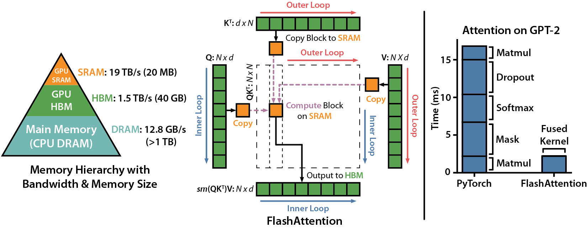

# FlashAttention
This repository provides the PPU implementation of FlashAttention-2 and FlashAttention-3 from the following papers.


**FlashAttention: Fast and Memory-Efficient Exact Attention with IO-Awareness**
Tri Dao, Daniel Y. Fu, Stefano Ermon, Atri Rudra, Christopher Ré
Paper: https://arxiv.org/abs/2205.14135
IEEE Spectrum [article](https://spectrum.ieee.org/mlperf-rankings-2022) about our submission to the MLPerf 2.0 benchmark using FlashAttention.



**FlashAttention-2: Faster Attention with Better Parallelism and Work Partitioning**
Tri Dao

Paper: https://tridao.me/publications/flash2/flash2.pdf


**FlashAttention-3: Fast and Accurate Attention with Asynchrony and Low-precision**
Jay Shah, Ganesh Bikshandi, Ying Zhang, Vijay Thakkar, Pradeep Ramani, and Tri Dao

Paper: https://arxiv.org/pdf/2407.08608

## FlashAttention PPU Support
The PPU version of Flash Attention supports building from source or using the released wheel package.

Currently released version supports:
- FP16 / BF16: forward and backward pass
- FP8: forward pass (FA3 only)
- Head dimensions up to 256

## PPU Backend Extensions and Optimizations

The PPU version includes targeted optimizations around data movement, TSM layout, Tensor Cell instructions, and scheduling, making FlashAttention-2 / FlashAttention-3 fit the PPU hardware characteristics more closely.

- **AIU + Swizzle data path**: The PPU version routes the movement of tiled Q/K/V data through the AIU and applies a swizzle layout when writing to TSM / shared memory. This allows data in shared storage to directly match the operand read pattern of the subsequent MMA operations, reducing separate data reshuffling and shared memory access conflicts.
- **PPU Tensor Cell mapping**: Matrix multiply-accumulate is organized as tiled MMA and mapped onto PPU Tensor Cell instructions, with the operand layouts and accumulator layouts required for FP16, BF16, and the FA3 FP8 forward pass filled in.
- **Tile strategy tuning**: Block shape, warp count, stage count, and Q register residency strategy are tuned for scenarios such as different head dimensions, dropout, causal, PagedKV, varlen, local attention, softcap, append KV, and SplitKV / PackGQA, improving execution efficiency across different input shapes.
- **PPU scheduling adaptation**: Based on the PPU's CU distribution and tile count, the underlying scheduler supports strategies such as persistent tile, dynamic persistent, and Stream-K / Split-K, improving load balancing for long/short sequences, variable-length batches, and multi-split scenarios.
- **Compilation options assisting backend orchestration**: The build parameters enable PPU/AIU support and configure HGCC backend optimization options such as register count, matrix address sinking, asynchronous address sinking, and load/store address sinking, helping the compiler better orchestrate memory access, register usage, and the compute pipeline.

## Build from Source

**Requirements:**
- PPU SDK
- ZW 610 / 610E / 810 / 810E / M530 / M890
- PyTorch 1.12 or higher (recommended to use Docker image matching the PPU SDK version)
- `packaging` Python package (`pip install packaging`)
- `psutil` Python package (`pip install psutil`)
- `ninja` Python package (`pip install ninja`)
- Linux


**Update submodules:**
```bash
git submodule update --init --recursive
```


**Build commands:**
```bash
# For FlashAttention-2:
python setup.py install
# Or:
python setup.py bdist_wheel

# For FlashAttention-3:
cd hopper/
python setup.py install
# Or:
python setup.py bdist_wheel
```


**After installation, you can import it as follows:**


```python
# FlashAttention-2 (installed as the `flash_attn` package)
import flash_attn
flash_attn.flash_attn_func()

# Or import the functions directly:
from flash_attn import (
    flash_attn_func,
    flash_attn_qkvpacked_func,
    flash_attn_kvpacked_func,
    flash_attn_varlen_func,
    flash_attn_varlen_qkvpacked_func,
    flash_attn_varlen_kvpacked_func,
    flash_attn_with_kvcache,
)
```

```python
# FlashAttention-3 (installed as the `flash_attn_3` package, exposing the
# top-level `flash_attn_interface` module)
import flash_attn_interface
flash_attn_interface.flash_attn_func()

# Or import the functions directly:
from flash_attn_interface import (
    flash_attn_func,
    flash_attn_qkvpacked_func,
    flash_attn_varlen_func,
    flash_attn_with_kvcache,
)
```


## How to use FlashAttention

### FlashAttention-2

The main functions implement scaled dot product attention (softmax(Q @ K^T * softmax_scale) @ V):

```python
from flash_attn import (
    flash_attn_qkvpacked_func,
    flash_attn_func,
    flash_attn_with_kvcache,
)
```


```python
def flash_attn_qkvpacked_func(qkv, dropout_p=0.0, softmax_scale=None, causal=False,
                              window_size=(-1, -1), softcap=0.0, alibi_slopes=None,
                              deterministic=False, return_attn_probs=False):
    """dropout_p should be set to 0.0 during evaluation.
    If Q, K, V are already stacked into 1 tensor, this function will be faster than
    calling flash_attn_func on Q, K, V since the backward pass avoids explicit concatenation
    of the gradients of Q, K, V.
    If window_size != (-1, -1), implements sliding window local attention. Query at position i
    will only attend to keys between [i - window_size[0], i + window_size[1]] inclusive.

    Arguments:
        qkv: (batch_size, seqlen, 3, nheads, headdim)
        dropout_p: float. Dropout probability.
        softmax_scale: float. The scaling of QK^T before applying softmax.
            Default to 1 / sqrt(headdim).
        causal: bool. Whether to apply causal attention mask (e.g., for auto-regressive modeling).
        window_size: (left, right). If not (-1, -1), implements sliding window local attention.
        alibi_slopes: (nheads,) or (batch_size, nheads), fp32. A bias of (-alibi_slope * |i - j|) is added to
            the attention score of query i and key j.
        deterministic: bool. Whether to use the deterministic implementation of the backward pass,
            which is slightly slower and uses more memory. The forward pass is always deterministic.
    Return:
        out: (batch_size, seqlen, nheads, headdim).
    """


def flash_attn_func(q, k, v, dropout_p=0.0, softmax_scale=None, causal=False,
                    window_size=(-1, -1), softcap=0.0, alibi_slopes=None,
                    deterministic=False, return_attn_probs=False):
    """dropout_p should be set to 0.0 during evaluation.
    Supports multi-query and grouped-query attention (MQA/GQA) by passing in KV with fewer heads
    than Q. Note that the number of heads in Q must be divisible by the number of heads in KV.
    For example, if Q has 6 heads and K, V have 2 heads, head 0, 1, 2 of Q will attention to head
    0 of K, V, and head 3, 4, 5 of Q will attention to head 1 of K, V.
    If window_size != (-1, -1), implements sliding window local attention. Query at position i
    will only attend to keys between
    [i + seqlen_k - seqlen_q - window_size[0], i + seqlen_k - seqlen_q + window_size[1]] inclusive.

    Arguments:
        q: (batch_size, seqlen, nheads, headdim)
        k: (batch_size, seqlen, nheads_k, headdim)
        v: (batch_size, seqlen, nheads_k, headdim)
        dropout_p: float. Dropout probability.
        softmax_scale: float. The scaling of QK^T before applying softmax.
            Default to 1 / sqrt(headdim).
        causal: bool. Whether to apply causal attention mask (e.g., for auto-regressive modeling).
        window_size: (left, right). If not (-1, -1), implements sliding window local attention.
        alibi_slopes: (nheads,) or (batch_size, nheads), fp32. A bias of
            (-alibi_slope * |i + seqlen_k - seqlen_q - j|)
            is added to the attention score of query i and key j.
        deterministic: bool. Whether to use the deterministic implementation of the backward pass,
            which is slightly slower and uses more memory. The forward pass is always deterministic.
    Return:
        out: (batch_size, seqlen, nheads, headdim).
    """


def flash_attn_with_kvcache(
    q,
    k_cache,
    v_cache,
    k=None,
    v=None,
    rotary_cos=None,
    rotary_sin=None,
    cache_seqlens: Optional[Union[(int, torch.Tensor)]] = None,
    cache_batch_idx: Optional[torch.Tensor] = None,
    cache_leftpad: Optional[torch.Tensor] = None,
    block_table: Optional[torch.Tensor] = None,
    softmax_scale=None,
    causal=False,
    window_size=(-1, -1),  # -1 means infinite context window
    softcap=0.0,  # 0.0 means deactivated
    rotary_interleaved=True,
    alibi_slopes=None,
    num_splits=0,
    return_softmax_lse=False,
):
    """
    If k and v are not None, k_cache and v_cache will be updated *inplace* with the new values from
    k and v. This is useful for incremental decoding: you can pass in the cached keys/values from
    the previous step, and update them with the new keys/values from the current step, and do
    attention with the updated cache, all in 1 kernel.

    If you pass in k / v, you must make sure that the cache is large enough to hold the new values.
    For example, the KV cache could be pre-allocated with the max sequence length, and you can use
    cache_seqlens to keep track of the current sequence lengths of each sequence in the batch.

    Also apply rotary embedding if rotary_cos and rotary_sin are passed in. The key @k will be
    rotated by rotary_cos and rotary_sin at indices cache_seqlens, cache_seqlens + 1, etc.
    If causal or local (i.e., window_size != (-1, -1)), the query @q will be rotated by rotary_cos
    and rotary_sin at indices cache_seqlens, cache_seqlens + 1, etc.
    If not causal and not local, the query @q will be rotated by rotary_cos and rotary_sin at
    indices cache_seqlens only (i.e. we consider all tokens in @q to be at position cache_seqlens).

    See tests/test_flash_attn.py::test_flash_attn_kvcache for examples of how to use this function.

    Supports multi-query and grouped-query attention (MQA/GQA) by passing in KV with fewer heads
    than Q. Note that the number of heads in Q must be divisible by the number of heads in KV.
    For example, if Q has 6 heads and K, V have 2 heads, head 0, 1, 2 of Q will attention to head
    0 of K, V, and head 3, 4, 5 of Q will attention to head 1 of K, V.

    If causal=True, the causal mask is aligned to the bottom right corner of the attention matrix.
    For example, if seqlen_q = 2 and seqlen_k = 5, the causal mask (1 = keep, 0 = masked out) is:
        1 1 1 1 0
        1 1 1 1 1
    If seqlen_q = 5 and seqlen_k = 2, the causal mask is:
        0 0
        0 0
        0 0
        1 0
        1 1
    If the row of the mask is all zero, the output will be zero.

    If window_size != (-1, -1), implements sliding window local attention. Query at position i
    will only attend to keys between
    [i + seqlen_k - seqlen_q - window_size[0], i + seqlen_k - seqlen_q + window_size[1]] inclusive.

    Note: Does not support backward pass.

    Arguments:
        q: (batch_size, seqlen, nheads, headdim)
        k_cache: (batch_size_cache, seqlen_cache, nheads_k, headdim) if there's no block_table,
            or (num_blocks, page_block_size, nheads_k, headdim) if there's a block_table (i.e. paged KV cache)
            page_block_size must be a multiple of 256.
        v_cache: (batch_size_cache, seqlen_cache, nheads_k, headdim) if there's no block_table,
            or (num_blocks, page_block_size, nheads_k, headdim) if there's a block_table (i.e. paged KV cache)
        k [optional]: (batch_size, seqlen_new, nheads_k, headdim). If not None, we concatenate
            k with k_cache, starting at the indices specified by cache_seqlens.
        v [optional]: (batch_size, seqlen_new, nheads_k, headdim). Similar to k.
        rotary_cos [optional]: (seqlen_ro, rotary_dim / 2). If not None, we apply rotary embedding
            to k and q. Only applicable if k and v are passed in. rotary_dim must be divisible by 16.
        rotary_sin [optional]: (seqlen_ro, rotary_dim / 2). Similar to rotary_cos.
        cache_seqlens: int, or (batch_size,), dtype torch.int32. The sequence lengths of the
            KV cache.
        cache_batch_idx: (batch_size,), dtype torch.int32. The indices used to index into the KV cache.
            If None, we assume that the batch indices are [0, 1, 2, ..., batch_size - 1].
            If the indices are not distinct, and k and v are provided, the values updated in the cache
            might come from any of the duplicate indices.
        cache_leftpad: (batch_size,), dtype torch.int32. The index that the KV cache starts. If None, assume 0.
        block_table [optional]: (batch_size, max_num_blocks_per_seq), dtype torch.int32.
        softmax_scale: float. The scaling of QK^T before applying softmax.
            Default to 1 / sqrt(headdim).
        causal: bool. Whether to apply causal attention mask (e.g., for auto-regressive modeling).
        window_size: (left, right). If not (-1, -1), implements sliding window local attention.
        softcap: float. Anything > 0 activates softcapping attention.
        rotary_interleaved: bool. Only applicable if rotary_cos and rotary_sin are passed in.
            If True, rotary embedding will combine dimensions 0 & 1, 2 & 3, etc. If False,
            rotary embedding will combine dimensions 0 & rotary_dim / 2, 1 & rotary_dim / 2 + 1
            (i.e. GPT-NeoX style).
        alibi_slopes: (nheads,) or (batch_size, nheads), fp32. A bias of
            (-alibi_slope * |i + seqlen_k - seqlen_q - j|)
            is added to the attention score of query i and key j.
        num_splits: int. If > 1, split the key/value into this many chunks along the sequence.
            If num_splits == 1, we don't split the key/value. If num_splits == 0, we use a heuristic
            to automatically determine the number of splits.
            Don't change this unless you know what you are doing.
        return_softmax_lse: bool. Whether to return the logsumexp of the attention scores.

    Return:
        out: (batch_size, seqlen, nheads, headdim).
        softmax_lse [optional, if return_softmax_lse=True]: (batch_size, nheads, seqlen). The
            logsumexp of each row of the matrix QK^T * scaling (e.g., log of the softmax
            normalization factor).
    """
```


### FlashAttention-3

FlashAttention-3 shares the same core API as FlashAttention-2, but is imported from the
`flash_attn_interface` module.

```python
from flash_attn_interface import (
    flash_attn_qkvpacked_func,
    flash_attn_func,
    flash_attn_varlen_func,
    flash_attn_with_kvcache,
)
```

```python
def flash_attn_qkvpacked_func(qkv, softmax_scale=None, causal=False,
                              q_descale=None, k_descale=None, v_descale=None,
                              window_size=(-1, -1), attention_chunk=0, softcap=0.0,
                              deterministic=False, num_heads_q=None, sm_margin=0,
                              return_attn_probs=False):
    """If Q, K, V are already stacked into 1 tensor, this function will be faster than
    calling flash_attn_func on Q, K, V since the backward pass avoids explicit concatenation
    of the gradients of Q, K, V.
    If window_size != (-1, -1), implements sliding window local attention. Query at position i
    will only attend to keys between [i - window_size[0], i + window_size[1]] inclusive.

    Arguments:
        qkv: (batch_size, seqlen, 3, nheads, headdim)
        softmax_scale: float. The scaling of QK^T before applying softmax.
            Default to 1 / sqrt(headdim).
        causal: bool. Whether to apply causal attention mask (e.g., for auto-regressive modeling).
        q_descale, k_descale, v_descale: (batch_size, nheads), fp32. Descale factors used for the
            FP8 forward pass. Set to None for FP16 / BF16.
        window_size: (left, right). If not (-1, -1), implements sliding window local attention.
        attention_chunk: int. If > 0, applies chunked (block-diagonal) attention of this chunk size.
        softcap: float. Anything > 0 activates softcapping attention.
        deterministic: bool. Whether to use the deterministic implementation of the backward pass,
            which is slightly slower and uses more memory. The forward pass is always deterministic.
        num_heads_q: int. Required only when qkv is 4-dimensional (packed GQA layout).
        sm_margin: int. Number of SMs to leave out for other work (e.g. communication).
        return_attn_probs: bool. Whether to also return the softmax logsumexp. For testing only.
    Return:
        out: (batch_size, seqlen, nheads, headdim).
    """


def flash_attn_func(q, k, v, softmax_scale=None, causal=False, qv=None,
                    q_descale=None, k_descale=None, v_descale=None,
                    window_size=(-1, -1), attention_chunk=0, softcap=0.0,
                    num_splits=1, pack_gqa=None, deterministic=False, sm_margin=0,
                    return_attn_probs=False, s_aux=None):
    """Supports multi-query and grouped-query attention (MQA/GQA) by passing in KV with fewer heads
    than Q. Note that the number of heads in Q must be divisible by the number of heads in KV.
    For example, if Q has 6 heads and K, V have 2 heads, head 0, 1, 2 of Q will attention to head
    0 of K, V, and head 3, 4, 5 of Q will attention to head 1 of K, V.
    If causal=True, the causal mask is aligned to the bottom right corner of the attention matrix.
    If window_size != (-1, -1), implements sliding window local attention. Query at position i
    will only attend to keys between
    [i + seqlen_k - seqlen_q - window_size[0], i + seqlen_k - seqlen_q + window_size[1]] inclusive.

    Arguments:
        q: (batch_size, seqlen, nheads, headdim)
        k: (batch_size, seqlen, nheads_k, headdim)
        v: (batch_size, seqlen, nheads_k, headdim_v)
        softmax_scale: float. The scaling of QK^T before applying softmax.
            Default to 1 / sqrt(headdim).
        causal: bool. Whether to apply causal attention mask (e.g., for auto-regressive modeling).
        qv [optional]: (batch_size, seqlen, nheads, headdim_v). Extra value tensor added to the output.
        q_descale, k_descale, v_descale: (batch_size, nheads), fp32. Descale factors for the FP8
            forward pass. Set to None for FP16 / BF16.
        window_size: (left, right). If not (-1, -1), implements sliding window local attention.
        attention_chunk: int. If > 0, applies chunked (block-diagonal) attention of this chunk size.
            Not supported in the backward pass.
        softcap: float. Anything > 0 activates softcapping attention.
        num_splits: int. If > 1, split the key/value into this many chunks along the sequence
            (Split-KV). If 0, a heuristic picks the number of splits automatically.
        pack_gqa: bool. Whether to pack the GQA heads to improve efficiency. If None, a heuristic
            decides. Don't change this unless you know what you are doing.
        deterministic: bool. Whether to use the deterministic implementation of the backward pass,
            which is slightly slower and uses more memory. The forward pass is always deterministic.
        sm_margin: int. Number of SMs to leave out for other work (e.g. communication).
        return_attn_probs: bool. Whether to also return the softmax logsumexp. For testing only.
    Return:
        out: (batch_size, seqlen, nheads, headdim).
    """


def flash_attn_varlen_func(q, k, v, cu_seqlens_q, cu_seqlens_k, max_seqlen_q, max_seqlen_k,
                           seqused_q=None, seqused_k=None, softmax_scale=None, causal=False,
                           qv=None, q_descale=None, k_descale=None, v_descale=None,
                           window_size=(-1, -1), attention_chunk=0, softcap=0.0,
                           num_splits=1, pack_gqa=None, deterministic=False, sm_margin=0,
                           return_attn_probs=False, s_aux=None):
    """Variable-length version of flash_attn_func for batches with unpadded / ragged sequences.

    Arguments:
        q: (total_q, nheads, headdim)
        k: (total_k, nheads_k, headdim)
        v: (total_k, nheads_k, headdim_v)
        cu_seqlens_q: (batch_size + 1,), dtype torch.int32. Cumulative sequence lengths for Q.
        cu_seqlens_k: (batch_size + 1,), dtype torch.int32. Cumulative sequence lengths for K.
        max_seqlen_q: int. The maximum sequence length in the Q batch.
        max_seqlen_k: int. The maximum sequence length in the K batch.
        seqused_q [optional]: (batch_size,), dtype torch.int32. Number of tokens actually used per
            Q sequence. If None, derived from cu_seqlens_q.
        seqused_k [optional]: (batch_size,), dtype torch.int32. Number of tokens actually used per
            K sequence. If None, derived from cu_seqlens_k.
        The remaining arguments match flash_attn_func.
    Return:
        out: (total_q, nheads, headdim).
    """


def flash_attn_with_kvcache(
    q,
    k_cache,
    v_cache,
    k=None,
    v=None,
    qv=None,
    rotary_cos=None,
    rotary_sin=None,
    cache_seqlens: Optional[Union[(int, torch.Tensor)]] = None,
    cache_batch_idx: Optional[torch.Tensor] = None,
    cache_leftpad: Optional[torch.Tensor] = None,
    page_table: Optional[torch.Tensor] = None,
    cu_seqlens_q: Optional[torch.Tensor] = None,
    cu_seqlens_k_new: Optional[torch.Tensor] = None,
    max_seqlen_q: Optional[int] = None,
    rotary_seqlens: Optional[torch.Tensor] = None,
    q_descale: Optional[torch.Tensor] = None,
    k_descale: Optional[torch.Tensor] = None,
    v_descale: Optional[torch.Tensor] = None,
    softmax_scale=None,
    causal=False,
    window_size=(-1, -1),  # -1 means infinite context window
    attention_chunk=0,
    softcap=0.0,  # 0.0 means deactivated
    rotary_interleaved=True,
    scheduler_metadata=None,
    num_splits=0,    # Can be tuned for speed
    pack_gqa=None,   # Can be tuned for speed
    sm_margin=0,     # Can be tuned if some SMs are used for communication
    return_softmax_lse=False,
    max_seqlen_k: Optional[int] = None,
    s_aux=None,
    qsa_allow_aiu: bool = False,
):
    """
    If k and v are not None, k_cache and v_cache will be updated *inplace* with the new values from
    k and v. This is useful for incremental decoding: you can pass in the cached keys/values from
    the previous step, and update them with the new keys/values from the current step, and do
    attention with the updated cache, all in 1 kernel.

    If you pass in k / v, you must make sure that the cache is large enough to hold the new values.
    For example, the KV cache could be pre-allocated with the max sequence length, and you can use
    cache_seqlens to keep track of the current sequence lengths of each sequence in the batch.

    Also apply rotary embedding if rotary_cos and rotary_sin are passed in. The key @k will be
    rotated by rotary_cos and rotary_sin at indices cache_seqlens, cache_seqlens + 1, etc.
    If causal or local (i.e., window_size != (-1, -1)), the query @q will be rotated by rotary_cos
    and rotary_sin at indices cache_seqlens, cache_seqlens + 1, etc.
    If not causal and not local, the query @q will be rotated by rotary_cos and rotary_sin at
    indices cache_seqlens only (i.e. we consider all tokens in @q to be at position cache_seqlens).

    See hopper/test_flash_attn.py::test_flash_attn_kvcache for examples of how to use this function.

    Supports multi-query and grouped-query attention (MQA/GQA) by passing in KV with fewer heads
    than Q. Note that the number of heads in Q must be divisible by the number of heads in KV.

    Note: Does not support backward pass.

    Arguments:
        q: (batch_size, seqlen, nheads, headdim)
        k_cache: (batch_size_cache, seqlen_cache, nheads_k, headdim) if there's no page_table,
            or (num_blocks, page_block_size, nheads_k, headdim) if there's a page_table (i.e. paged
            KV cache). page_block_size must be a multiple of 256.
        v_cache: (batch_size_cache, seqlen_cache, nheads_k, headdim_v) if there's no page_table,
            or (num_blocks, page_block_size, nheads_k, headdim_v) if there's a page_table.
        k [optional]: (batch_size, seqlen_new, nheads_k, headdim). If not None, we concatenate
            k with k_cache, starting at the indices specified by cache_seqlens.
        v [optional]: (batch_size, seqlen_new, nheads_k, headdim_v). Similar to k.
        qv [optional]: (batch_size, seqlen, nheads, headdim_v).
        rotary_cos [optional]: (seqlen_ro, rotary_dim / 2). If not None, we apply rotary embedding
            to k and q. Only applicable if k and v are passed in. rotary_dim must be divisible by 16.
        rotary_sin [optional]: (seqlen_ro, rotary_dim / 2). Similar to rotary_cos.
        cache_seqlens: int, or (batch_size,), dtype torch.int32. The sequence lengths of the KV cache.
        cache_batch_idx: (batch_size,), dtype torch.int32. The indices used to index into the KV cache.
            If None, we assume that the batch indices are [0, 1, 2, ..., batch_size - 1].
        cache_leftpad: (batch_size,), dtype torch.int32. The index that the KV cache starts. If None, assume 0.
        page_table [optional]: (batch_size, max_num_blocks_per_seq), dtype torch.int32.
            Pass (total_q, 1, topk) instead to select query-sparse attention (QSA), where each row
            holds the token indices selected for one unpadded query token. Requires head dim 256,
            cu_seqlens_q, no cache_batch_idx, and a build with FLASH_ATTENTION_ENABLE_QSA.
        q_descale, k_descale, v_descale: (batch_size, nheads), fp32. Descale factors for the FP8
            forward pass. Set to None for FP16 / BF16.
        softmax_scale: float. The scaling of QK^T before applying softmax. Default to 1 / sqrt(headdim).
        causal: bool. Whether to apply causal attention mask (e.g., for auto-regressive modeling).
        window_size: (left, right). If not (-1, -1), implements sliding window local attention.
        attention_chunk: int. If > 0, applies chunked (block-diagonal) attention of this chunk size.
        softcap: float. Anything > 0 activates softcapping attention.
        rotary_interleaved: bool. Only applicable if rotary_cos and rotary_sin are passed in.
            If True, rotary embedding will combine dimensions 0 & 1, 2 & 3, etc. If False,
            rotary embedding will combine dimensions 0 & rotary_dim / 2, 1 & rotary_dim / 2 + 1
            (i.e. GPT-NeoX style).
        scheduler_metadata: precomputed scheduling metadata from get_scheduler_metadata, reused
            across calls to avoid recomputing the split/pack heuristics.
        num_splits: int. If > 1, split the key/value into this many chunks along the sequence
            (Split-KV). If 0, a heuristic picks the number of splits automatically.
        pack_gqa: bool. Whether to pack the GQA heads to improve efficiency. If None, a heuristic decides.
        qsa_allow_aiu: bool. QSA only: certify that every 16-column-aligned group of the
            (total_q, 1, topk) table holds 16 pool-contiguous tokens, the layout the AIU paged-KV
            bulk load assumes. Defaults to False, which routes QSA through the per-column load that
            honors each entry individually. A scattered top-k list MUST keep this False or the kernel
            silently attends to the wrong K/V.
        sm_margin: int. Number of SMs to leave out for other work (e.g. communication).
        return_softmax_lse: bool. Whether to return the logsumexp of the attention scores.

    Return:
        out: (batch_size, seqlen, nheads, headdim).
        softmax_lse [optional, if return_softmax_lse=True]: (batch_size, nheads, seqlen).
    """
```


## Tests

To run the tests:
```bash
pytest -q -s tests/test_flash_attn.py

# If using Flash Attention 3:
pytest -q -s hopper/test_flash_attn.py
```

## Issue Reporting
Please submit a Code Issue if you encounter any problems!

